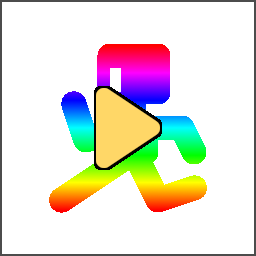

#  Godot Custom Runner

Best explained with a video probably:


As you can see, a typical "level" scene is currently open, but a special context menu option runs a "game" scene instead and loads the level. The "player" icon spawns at the cursor position from the editor.

This is basically it. The CustomRunner will run a specific scene in your project and pass some data from the editor to the game (using magic). You can then use the data to e.g. load a level or place the player at the cursor position, so you can easier test your stuff.

### Running

You can invoke Custom Runner in two ways:
- Using the context menu option in the 2D editor. It only appears when CustomRunner can run that scene.
- Pressing the Play Custom Scene shortcut (default F7).
- Pressing the Replay Custom Scene (default Shift+F7).

The first two options will first call methods to get run options (see below). The last one will invoke the runner with the last used options (i.e. same scene, same cursor position etc.), and is only available after you use either of the previous options at leasto nce.

### Configuration

Before running is possible, you need to configure the plugin. Custom Runner uses a configuration file, which is a script that extends CustomRunner class. By default it uses `DefaultConfig.gd` provided in the addon's folder. You can provide your own configuration using `addons/custom_runner/config_script` project setting. Copy the default configuration file or just edit it directly.

The configuration consists of a few virtual methods that have to be implemented:

`func _can_play_scene(scene: Node) -> bool:` - This method will determine whether the current scene can be used to run the plugin. Example implementation:
```GDScript
func _can_play_scene(scene: Node) -> bool:
	return scene is Level # Runs if the currently opened scene is a Level.
```

`func _gather_variables(scene: Node):` - This method is called before running scene. Use it to pass any data you want from the editor. The `scene` argument is a reference to the root of currently opened scene. You can add more data by using `add_variable("variable", value)`. Current scene path is passed by default, and the default configuration also includes editor's mouse position. `value` can't be Object-based type.

Example implementation:
```GDScript
func _gather_variables(scene: Node):
	add_variable("mouse_pos", get_click_position()) # Add current cursor position.
```
(`get_click_position()` is a special method that you can use to get cursor position in 2D editor)

`func _get_game_scene(for_scene: Node) -> String:` - Return the UID/path of the main scene you want to use. Typically, there's a "game" scene in the project, which then loads a level scene and adds it as a child. If you don't have such scene, return empty string (the runner will just run the currently opened scene). Example implementation:
```GDScript
func _get_game_scene(for_scene: Node) -> String:
	return "res://Scenes/Game.tscn"
 ```
 
 With the example code above, pressing the run shortcut when you have a scene opened that has Level root node will run `Game.tscn` scene and pass `scene` variable with file path of your level and `mouse_pos` with cursor position at the time of running. This is what happens in the video above.

 The shortcuts mentioned before can be configured in Editor Settings' Shortcuts tab, under Custom Runner group.
 
 ### Retrieving the data
 
There are 2 static methods to interact with the plugin from within the game:
`is_custom_running()` - Returns true if the game was launched using the plugin.
`get_variable(variable: String)` - Returns the value of the given variable.

Example handler for the code above:
```GDScript
func _ready():
	if CustomRunner.is_custom_running():
		var level_path = CustomRunner.get_variable("scene") # Retrieve the level scene.
		var level = load(level_path).instance() # Load the level.
		add_child(level) # Add it as a child.
		var pos = CustomRunner.get_variable("mouse_pos") # Retrieve the cursor position.
		$Player.position = pos # Move the player to cursor.
```

### Example project

The repository includes an example project, used in the video at the beginning. You can use it to test the plugin in action and as a reference for configuring it.

The CustomRunner class also comes with a documentation for its methods.

___

 The plugin works well with my [Metroidvania System](https://github.com/KoBeWi/Metroidvania-System) addon:

The integration guide is included in the README.

___
You can find all my addons on my [profile page](https://github.com/KoBeWi).

<a href='https://ko-fi.com/W7W7AD4W4' target='_blank'></a>
